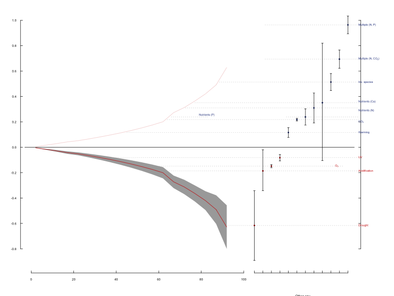
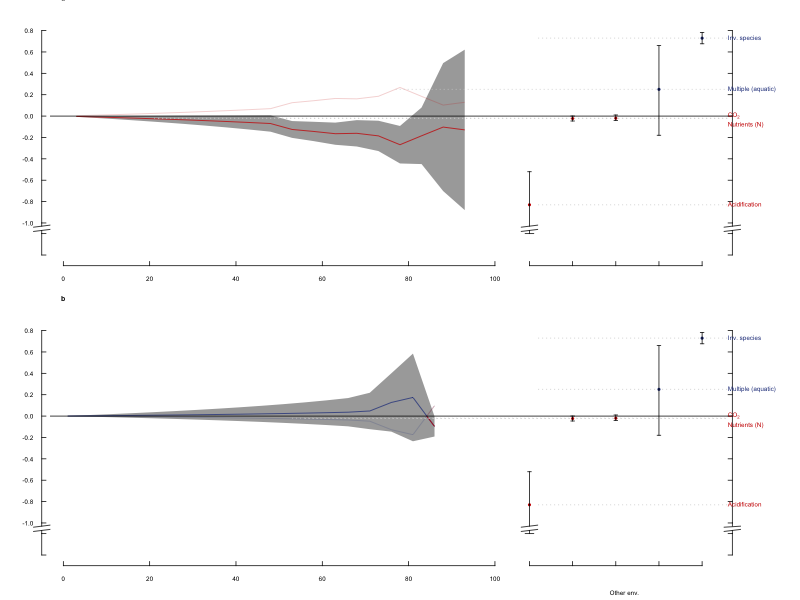

summary_report
========================================================
author: Alejandra, Aurélie & Pablo
date: 9th February 2016
width: 1440
height: 900

<style>
.small-code pre code {
  font-size: 1em;
}
</style>

The reproduction
========================================================

Hooper *et al.* 2012

A gobal synthesis reveals biodiversity loss a major driver of ecosystem change.
[paper here](http://jarrettbyrnes.info/pdfs/Hooper_et_al_2012_Nature.pdf)


Our goals
========================================================
* How to do a meta-analysis (Ale, Aurélie & Pablo)
* Introduction to GitHub (Pablo)
* Understand R script (Ale)

The study
========================================================
| Observed variables | Explanatory variables                                                 | Nb studies (observations) |
|--------------------|-----------------------------------------------------------------------|---------------------------|
| Productivity       | Species loss                                                          | 62 (379 obs)              |
| Decomposition      | Detrital consumer diversity                                           | 19 (54 obs)               |
| Decomposition      | Plant litter diversity                                                | 22 (60 obs)               |
|                    | Other environmental changes:                                          |                           |
|                    | nutrients, invasive species, CO2, warming, UV, acidification, drought |                           |

Import the data
========================================================
class:small-code

```r
#clear R
rm(list=ls())
library(plyr)
library(RCurl)

# Power coefficients of the effect of biodiversity loss on productivity
powInfo <- read.csv(text=getURL("https://raw.githubusercontent.com/opetchey/RREEBES/master/Hooper_etal_2012/Data_Fig_1_and_2/PowerCoeffs_Prod_min.csv"), check.names=FALSE) 

# Power coefficients of the effect of biodiversity loss (consumers) on decomposition
powInfoCons <- read.csv(text=getURL("https://raw.githubusercontent.com/opetchey/RREEBES/Hooper_et_al_2012/Hooper_etal_2012/data/PowerCoeffs_ConsumDivDecomp_min.csv"), check.names=FALSE)

# Power coefficients of the effect of biodiversity loss (litter) on decomposition
powInfoLitt <- read.csv(text=getURL("https://raw.githubusercontent.com/opetchey/RREEBES/master/Hooper_etal_2012/Data_Fig_1_and_2/PowerCoeffs_LitterDivDecomp_min.csv"), check.names=FALSE)

# Select the studies that were included in the meta-analysis 
powInfo<-subset(powInfo,powInfo$FinalT=="Y")
powInfoCons<-subset(powInfoCons,powInfoCons$FinalT=="Y")
powInfoLitt<-subset(powInfoLitt,powInfoLitt$FinalT=="Y")


# Effects of environmnetal factors affecting productivity
prod.other <- read.csv(text=getURL("https://raw.githubusercontent.com/opetchey/RREEBES/master/Hooper_etal_2012/Data_Fig_1_and_2/Prod_OtherFactors.csv"), check.names=FALSE)

# Effects of environmnetal factors affecting decomposition
decomp.other <- read.csv(text=getURL("https://raw.githubusercontent.com/opetchey/RREEBES/Hooper_et_al_2012/Hooper_etal_2012/data/Decomp_OtherFactors.csv"), check.names=FALSE)
```

 
========================================================

Figure 1: Changes in primary production as a function of per cent local species loss.




On the left: effects of **species loss** on change in productivity;

On the right: effects of **others environmental changes** on change in productivity


========================================================
class:small-code
left:40%

Figure 1: Changes in primary production as a function of per cent local species loss.


***
On the left:
Effects of species loss on change in productivity

!! here we have the raw data to compute the curve

```r
str(powInfo)
```

```
'data.frame':	308 obs. of  8 variables:
 $ Entry : int  26 29 44 45 46 47 48 51 54 84 ...
 $ Study : int  5 5 8 8 8 8 8 10 10 19 ...
 $ Expt  : Factor w/ 299 levels "103","104","105",..: 8 16 37 43 44 45 48 65 65 122 ...
 $ Smax  : int  24 24 7 9 6 6 4 6 6 6 ...
 $ powa  : num  2.666 0.385 NA 0.911 0.591 ...
 $ powb  : num  1.1798 1.9978 NA 0.1082 0.0596 ...
 $ Smin  : int  19 19 1 1 1 1 1 1 1 1 ...
 $ FinalT: Factor w/ 2 levels "N","Y": 2 2 2 2 2 2 2 2 2 2 ...
```


========================================================
class:small-code
left:40%


Figure 1: Changes in primary production as a function of per cent local species loss.


***
On the right:
Effects of other environmental change on change in productivity

!! here they give only the resutls

```r
prod.other
```

```
                    group         est       lower       upper diffpt xval
1                 Drought -0.61618614 -0.89159812 -0.34249031      1  105
2           Acidification -0.18632958 -0.34249031 -0.02020271      1  109
3         Elevated Ozone  -0.14885400 -0.16091880 -0.13678920      1  113
4                      UV -0.08228255 -0.10716390 -0.05740122      1  117
5                Warming   0.11600368  0.07774496  0.15426239      0  121
6          Elevated CO2    0.21736250  0.20732110  0.22740390      0  125
7                 Added P  0.23873300  0.17513770  0.30232830      0  129
8                Added N   0.30975570  0.19179970  0.42771180      0  133
9            Nutrients Ca  0.35065687 -0.10536052  0.81977983      0  137
10        Plant Invasion   0.51361530  0.44654890  0.58068170      0  141
11 Added N & Elevated CO2  0.69410740  0.62221130  0.76600350      0  145
12           Added N & P   0.96390320  0.89404410  1.03376200      0  149
```

Reproduction
=========================================================

Figure 2: Changes in decomposition as a function of per cent local species loss.




on the top: effect of **detrital consumer diversity** on decomposition;

on the bottom: effect of **plant litter diversity** on decomposition


Reproduction of the tables:
=========================================================

We did not have the data necessary to reproduce the tables 1 & 2


What did we learn
=========================================================
## with this study
- to homogeneise between error sources (SE, SD, CI) (function provided by the author)
- to integrate data from different sources

## for all reproductions
- the limit of reproduction when the raw data are not available
- the danger of provided code/script 

## Comments
The code provided was well explained and convenient for learning.

Meta-analyses are complex to reproduce because the raw data are not directly available (only effect sizes, the rest has to be looked for in other papers and it would take much longer - its like reproducing hundreds of papers at the same time). 


