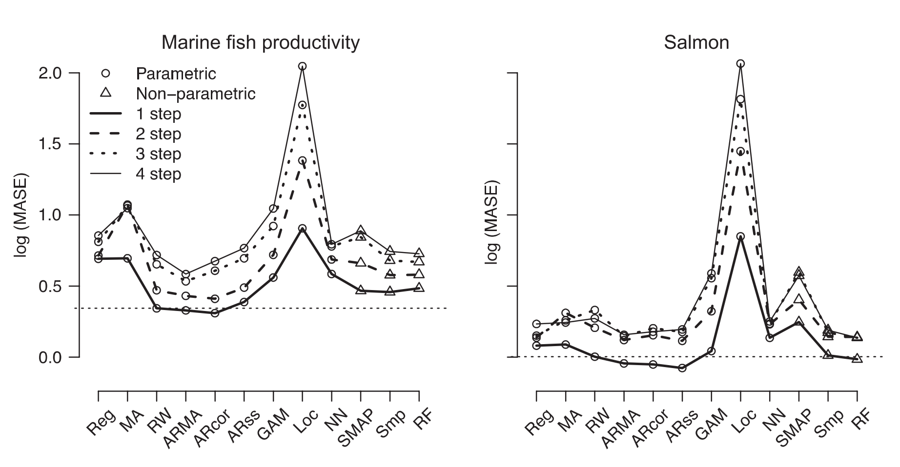

```{r setup, include=FALSE}
knitr::opts_chunk$set(cache=TRUE, echo=F)
```

```{r, echo=F, message=FALSE}
library(dplyr)
library(ggplot2)
```

```{r, echo=F}
# load object with script output
load("Ward_et_al_results.RData")

models_selected <- subset(prediction_ASE, model_type %in% c("GAM (gam)", "nnetTs.11 (nnetTs)", "AR - no drift (rwf)", "Local regression (locfit)", "ARIMA 1.0.1 (arima)","Exp smooth (freq=1) (ets)" , "ARIMA 0.0.1 (arima)", "ARIMA 1.1.0 (arima)", "MARSSdrift", "SMAP v2", "Simplex v2" , "randomForest v2", "simple regression"))
models_selected$model_type <- factor(models_selected$model_type)
models_selected$model_type <- factor(models_selected$model_type,levels(models_selected$model_type)[c(13,7,3,6,4,8,9,1,5,2,11,10,12)])
models_selected$data_dist <- ifelse(models_selected$model_type %in% c("GAM (gam)", "nnetTs.11 (nnetTs)", "AR - no drift (rwf)", "Local regression (locfit)", "ARIMA 1.0.1 (arima)","Exp smooth (freq=1) (ets)" , "ARIMA 0.0.1 (arima)", "ARIMA 1.1.0 (arima)", "MARSSdrift", "simple regression"), "parametric", "non-parametric")

#models_selected <- na.omit(models_selected)

```


# Some time series and predictions

```{r}
library(dplyr)
library(ggplot2)
ggplot(filter(models_selected, ID %in% 1:2),
       aes(x=Year, y=Value)) +
  geom_line() + geom_point() +
  geom_line(aes(x=Year, y=Value_predicted, col=model_type)) +
  geom_point(aes(x=Year, y=Value_predicted, col=model_type)) +
  facet_wrap(~ID, scales = "free", ncol=1)

```

Without local regression:

```{r}
ggplot(filter(models_selected, ID %in% 1:2, model_type!="Local regression (locfit)"),
       aes(x=Year, y=Value)) +
  geom_line() + geom_point() +
  geom_line(aes(x=Year, y=Value_predicted, col=model_type)) +
  geom_point(aes(x=Year, y=Value_predicted, col=model_type)) +
  facet_wrap(~ID, scales = "free", ncol=1)

```


# Are any models good (or bad) across all time series?

Recreate the original figure, which shows the average ASE of each model, for each model tested against every time series. This asks whether any of the models are generally (i.e., across all time series) good (or bad):

```{r}

## first get the mean ASE by model and step ahead, and log this mean
mean_ASE <- group_by(models_selected, Database, model_type, data_dist, step_ahead) %>%
  summarize(log_mean_ASE = log(mean(ASE, na.rm = T)))
       
## plot...
ggplot(data=subset(mean_ASE, step_ahead<5 & log_mean_ASE<60 &
                     (Database == "salmon" | Database == "RAMlegacy.recperssb")),
       aes(x=model_type, y=log_mean_ASE, group=step_ahead,
           linetype=as.factor(step_ahead), size=as.factor(step_ahead),
           shape=data_dist)) +
  geom_point(size=2) +
  geom_line() + 
  theme(axis.text.x  = element_text(angle=90, vjust=0.5, size=10)) +
  scale_linetype_manual(values=c("solid", "dashed", "dotted", "solid")) +
  scale_size_manual(values=c(0.8,0.8,0.8,0.4))  +
  scale_shape_manual(values=c(2,1)) +
  facet_wrap(~Database)
```

And the figure from the original paper:

<div style="width:500px; height=200px">

</div>


# How good is the best model for each time series?

Find best (minimum mean ASE) model for each time series:

```{r, echo=F}

## First get the mean ASE over the step_aheads
model_mean_ASE <- group_by(models_selected, ID, model_type, Database) %>%
  summarise(mean_ASE=mean(ASE, na.rm=T))

## Then find the best model (lowest mean_ASE) for each time series
best_model_mean_ASE <- group_by(model_mean_ASE, ID, Database) %>%
  slice(which.min(mean_ASE))

## Subset the original data to include only the best model for each time series
## (convenient to use join() for this)
only_best <- inner_join(best_model_mean_ASE[,-4], na.omit(models_selected))

## Get the mean_ASE for each model and step ahead
mean_ASE_best <- group_by(only_best, model_type, step_ahead, data_dist, Database) %>%
  summarise(mean_ASE=mean(ASE, na.rm=T), count_n=n())

## log transform mean_ASE
mean_ASE_best <- mutate(mean_ASE_best, log_best_mean_ASE=log(mean_ASE))

```


Overlay on the original figure:

```{r}

 
ggplot(data=subset(mean_ASE, step_ahead<5 & log_mean_ASE<60 &
                     (Database == "salmon" | Database == "RAMlegacy.recperssb")),
       aes(x=model_type,y=log_mean_ASE, group=step_ahead,
           linetype=as.factor(step_ahead), size=as.factor(step_ahead),
           shape=data_dist)) +
  geom_point(size=2) +
  geom_line() + 
  theme(axis.text.x  = element_text(angle=90, vjust=0.5, size=10)) +
  scale_linetype_manual(values=c("solid", "dashed", "dotted", "solid")) +
  scale_size_manual(values=c(0.8,0.8,0.8,0.4))  +
  scale_shape_manual(values=c(2,1)) +
  facet_wrap(~Database)  +
 geom_line(data=subset(mean_ASE_best, step_ahead<5 &
                   (Database == "salmon" | Database == "RAMlegacy.recperssb")),
            aes(x=model_type, y=log_best_mean_ASE, group=step_ahead,
                linetype=as.factor(step_ahead), size=as.factor(step_ahead),
                shape=data_dist),
           colour="red") 
  
 
 
```

Its not really so useful to make this comparison, as the results pretty much have to be as they are (better prediction by the best model for each time series, than for all models for all time series). It may be somewhat interesting to see that the MASE is often now less than 1 (0 on log scale), as MASE = 1 is what one expects as for a random walk model for long time series, though note that also the random walk model often has MASE less than 1, probably just by chance.

Could compare the MASE of the best model (not including random walk) to that of the random walk MASE.

Though the bigger issue that needs resolution is using the test data (the last five data points) for model selection. The test data should be reserved for model validation (e.g., input-output transormation validation) only. 


How many times is each model the best?

```{r}
ggplot(filter(mean_ASE_best, step_ahead==1 & 
                     (Database == "salmon" | Database == "RAMlegacy.recperssb")),
       aes(x=model_type, y=count_n)) +
  geom_point() +
  facet_wrap(~Database) +
    theme(axis.text.x  = element_text(angle=90, vjust=0.5, size=10)) 

  
```


# Length of time series

```{r, echo=F}
ts_length <- models_selected %>% 
  filter(model_type=="randomForest v2") %>% ## arbitrary model_type
  group_by(ID) %>%
  summarise(ts_length=n())
#qplot(data=ts_length, x=ts_length)
```

```{r, echo=F}
bb <- full_join(ts_length, best_model_mean_ASE)
qplot(data=bb, x=log(ts_length), y=log(mean_ASE),
      xlab="Length of time series", ylab="mean ASE of best predictions")
```


```{r, echo=F, eval=F}
Find difference from random walk???
rand_walk <- filter(models_selected, model_type=="AR - no drift (rwf)") %>%
  select(-model_type)
the_rest  <- filter(models_selected, model_type!="AR - no drift (rwf)")
names(rand_walk)[11:12] <- c("RW_prediction", "RW_ASE")
dd <- full_join(rand_walk, the_rest)
dd <- arrange(dd, ID, model_type, Year)

```


Ensemble prediction per time step:

```{r}
dd <- filter(models_selected, step_ahead == 1 & ID == 3) 
ggplot(data=dd,aes(x=Value_predicted)) + geom_density() + geom_vline(aes(xintercept=Value), colour="red")
```


